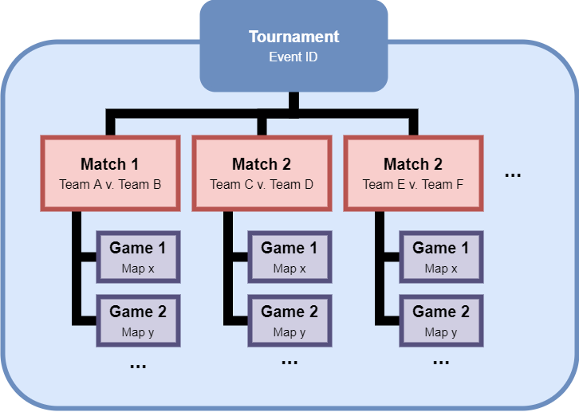

# Valorant Liquidpedia Scraper

[Valorant](https://playvalorant.com/en-us/) is a Free to Play fps shooter by Riot Games similar to Counter Strike. The major difference between the two games is that in Valorant there are "agents" to pick in the beginning of the game that greatly warp the gameplay with the abilities they can use throughout the course of the match.

The goal of this projects is to scrape [Liquidpedia](https://liquipedia.net/valorant), a wiki of the most recent games played by professional Valorant players, to understand the breakdown of agent picks. Below is a breakdown of the schema structure of tournaments that are run. The agent picks occur during the games once the map has been selected.




## Progress

Characters and Maps included as of 7/25/2020:
```
characterDB = ['Cypher','Sage','Jett','Phoenix','Brimstone','Breach','Viper','Sova','Reyna','Omen','Raze']
mapDB = ['Haven','Bind','Ascent','Split']
```

Current Capabilities

- [x] Pick rates by agent for tournament `ls.get_lp_val_stats(event)`
- [x] % Play Rates on Maps for tournament `ls.get_lp_val_charXmap(event)`
- [ ] Value of Replacement for Agents.
- [ ] Ability to build a repository of Agents.
